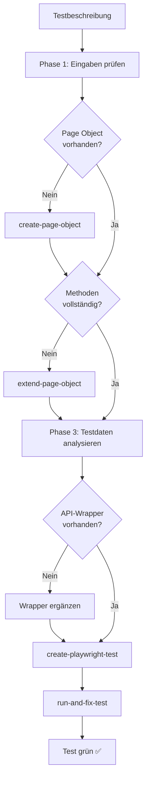

# KI-gestützte Playwright-Testautomatisierung im Schulportal

> Dokumentation des vollständigen Workflows — Basis für Präsentation / PowerPoint

---

## Überblick

GitHub Copilot übernimmt den gesamten Weg von einer fachlichen Testbeschreibung bis zum grünen, automatisierten E2E-Test. Der Workflow ist in **5 Phasen** unterteilt und orchestriert vier spezialisierte Skills, die jeweils eine klar abgegrenzte Aufgabe erfüllen.

**Kernidee:**  
Ein Entwickler oder Tester liefert nur die *fachliche Beschreibung* des Testfalls — Copilot erledigt den Rest: Page Objects erstellen, fehlende Locators ergänzen, Testdaten planen, Testcode schreiben und Fehler iterativ beheben.

---

## Die 5 Phasen des Workflows

### Phase 1 — Testbeschreibung einholen

Copilot startet nicht ohne vollständige Eingaben.

| Pflichtangabe | Beispiel |
|---|---|
| Fachliche Beschreibung (Schritte, Ziel) | „Schuladmin legt eine neue Klasse an und prüft die Anzeige in der Liste" |
| Handelnde Rolle | Landesadmin, Schuladmin, Lehrkraft … |
| Betroffene Seite(n) / URL(s) | `/admin/klassen/new` |
| Tags | `[DEV]` (Standard) oder `[STAGE]` |

Falls Informationen fehlen, fragt Copilot nach — bevor irgendein Code geschrieben wird.

---

### Phase 2 — Page Objects prüfen und vorbereiten

Copilot leitet aus der Beschreibung ab, welche **Page-Object-Klassen** benötigt werden, und prüft für jede:

1. **Existiert das Page-Object?**  
   - Nein → Skill `create-page-object` ausführen  
   - Ja → weiter mit Schritt 2

2. **Sind alle benötigten Methoden und Locators vorhanden?**  
   - Fehlende Elemente → Skill `extend-page-object` ausführen  
   - Alles vorhanden → direkt weiter mit Phase 3

> Tests enthalten **keine** Locators oder Logik direkt — alles gehört in die Page-Objects.

---

### Phase 3 — Testdaten planen und API-Wrapper prüfen

Bevor Testcode entsteht, wird der **Testdaten-Bedarf** vollständig geplant:

- Welche Entitäten werden benötigt? (Personen, Schulen, Klassen, Rollen)
- Welche Szenarien gibt es? (Positivfall, Konfliktfall, Mehrklassen-Szenario)
- Welche Einträge müssen im `afterEach` wieder gelöscht werden?
- Sind alle API-Wrapper in `base/api/` und `tests/helpers/` vorhanden?

Der Testdaten-Plan wird dem Nutzer zur **Freigabe** vorgelegt — erst danach geht es weiter.  
Nach Freigabe wird der Plan gespeichert und von `create-playwright-test` als Grundlage genutzt.

---

### Phase 4 — Test erstellen

Skill `create-playwright-test` generiert die `.spec.ts`-Datei nach den Projektkonventionen:

- Dateiname im PascalCase (`KlasseAnlegen.spec.ts`)
- Ein Use-Case pro Datei
- `beforeEach` mit API-basiertem Testdaten-Setup (laut freigegebenem Plan)
- `afterEach` mit vollständigem Cleanup
- Fachliche `test.step()`-Blöcke auf Deutsch
- Alle Aktionen und Assertions über Page-Object-Methoden (keine direkten Locators im Test)

---

### Phase 5 — Test ausführen und reparieren

Skill `run-and-fix-test` führt den Test aus und behebt Fehler iterativ:

1. Test ausführen (`npx playwright test … --reporter=list`)
2. Bei Fehler: Fehlermeldung, Screenshot (`test-failed-1.png`) und DOM-Snapshot (`error-context.md`) analysieren
3. Fix implementieren (Locator, `await`, Erwartungstext, Import)
4. Zurück zu Schritt 1 — solange bis der Test grün ist

**Abbruchbedingungen:** Test grün, 5 Iterationen ohne Fortschritt, oder Infrastruktur-Fehler (Backend nicht erreichbar).

---

## Ablaufdiagramm

---

## Die 4 Skills im Detail

### `create-page-object`

**Zweck:** Erstellt eine neue TypeScript-Klasse für eine Admin-Seite im Schulportal.

**Vorgehen:**
1. Copilot öffnet die Zielseite per **Playwright MCP** im Browser (Live-Inspektion)
2. Alle `data-testid`-Attribute und interaktiven Elemente werden automatisch ermittelt
3. Die TypeScript-Klasse wird nach Projektkonventionen generiert und in `pages/admin/<bereich>/` abgelegt

**Ergebnis:** Eine vollständige `*.page.ts`-Datei mit Konstruktor, Locators, Aktionsmethoden (`/* actions */`) und Assertions (`/* assertions */`).

---

### `extend-page-object`

**Zweck:** Erweitert eine bestehende Page-Klasse um neue Locators und Methoden — ohne bestehenden Code zu verändern.

**Vorgehen:**
1. Bestandsdatei lesen und analysieren (vorhandene Felder, Methoden, Blockreihenfolge)
2. Zielseite per **Playwright MCP** live inspizieren — gezielt nach den neuen `data-testid`-Attributen suchen
3. Neue Felder und Methoden konfliktfrei einfügen (Blockreihenfolge: Felder → Constructor → actions → assertions)

**Ergebnis:** Bestehende Page-Datei wurde erweitert; kein bestehender Code wurde geändert.

---

### `create-playwright-test`

**Zweck:** Generiert eine neue `.spec.ts`-Testdatei nach den Projektkonventionen.

**Vorgehen:**
1. Testbeschreibung und freigegebenen Testdaten-Plan als Input verwenden
2. `beforeEach` mit API-basiertem Setup implementieren (Personen, Schulen, Klassen via REST-API anlegen)
3. Testschritte als `test.step()`-Blöcke strukturieren
4. Alle Aktionen und Assertions über Page-Object-Methoden aufrufen
5. `afterEach` mit vollständigem Cleanup (Personen, Rollen, Schulen löschen)

**Wichtige Regeln:**
- Tests enthalten **keine** Locators oder Funktionslogik
- Backend-Constraints beachten (z. B. Schüler immer mit Schule + Klasse anlegen)
- Tags alphabetisch sortiert: `{ tag: ['@DEV', '@STAGE'] }`

---

### `run-and-fix-test`

**Zweck:** Führt einen Test iterativ aus und behebt Fehler automatisch.

**Vorgehen:**
1. `maxFailures` in `playwright.config.ts` temporär auf `0` setzen
2. Test mit `npx playwright test … --reporter=list` ausführen
3. Bei Fehler: Screenshot und DOM-Snapshot aus `test-results/` analysieren
4. Fehler klassifizieren und gezielt beheben (nur den identifizierten Fehler, keine spekulativen Änderungen)
5. Wiederholen bis Exit Code 0
6. `maxFailures` wieder auf `2` zurücksetzen

**Typische Fehlerklassen:**

| Fehlertyp | Typische Ursache | Fix |
|---|---|---|
| `TimeoutError` | Locator falsch oder `await` fehlt | Locator oder `await` korrigieren |
| `toHaveText` schlägt fehl | Text im UI geändert | Erwartungstext im Spec anpassen |
| TypeScript-Fehler | Falsche Typen oder fehlende Imports | Typen / Imports korrigieren |
| `page.goto` schlägt fehl | URL oder Routing-Problem | Navigation prüfen |

---

## Projektkonventionen (Kurzfassung)

| Regel | Bedeutung |
|---|---|
| Tests enthalten keine Logik | Aktionen und Assertions gehören in Page-Objects |
| Locators nur in Pages | `getByTestId()` ausschließlich in Page-Klassen |
| Eine `.spec.ts` pro Use-Case | Kein Mischen verschiedener fachlicher Themen |
| API-basierte Testdaten | Kein statisches Testdaten-Setup; alles per REST-API |
| Cleanup in `afterEach` | Alle angelegten Entitäten nach dem Test löschen |
| Schüler immer mit Klasse | Backend-Constraint: `LERN_NOT_AT_SCHULE_AND_KLASSE` |

---

## Technischer Kontext

| Komponente | Details |
|---|---|
| Test-Framework | Playwright mit TypeScript |
| Testverzeichnis | `tests/` |
| Page-Objects | `pages/` und `pages/admin/<bereich>/` |
| API-Wrapper | `base/api/` und `tests/helpers/` |
| Konfiguration | `playwright.config.ts` |
| Locator-Konvention | `getByTestId('<data-testid>')` |
| Globaler Timeout | 90 Sekunden pro Test, 10 Sekunden für `expect` |
| Befehl Typ-Prüfung | `npm run type-check` |

---

## Zusammenfassung: Was leistet die KI?

| Aufgabe | Manuell bisher | Mit KI-Workflow |
|---|---|---|
| Page-Object erstellen | Manuell aus DOM ableiten | Automatisch per Live-Inspektion (MCP) |
| Locators ermitteln | Browser-DevTools öffnen | KI öffnet Browser und liest `data-testid` aus |
| Testdaten planen | Im Kopf oder Notizen | Strukturierter Plan, zur Freigabe vorgelegt |
| Test schreiben | Volle Implementierung | KI generiert nach Konventionen |
| Fehler beheben | Manuelles Debugging | Iterativer Zyklus: Ausführen → Analysieren → Fixen |
